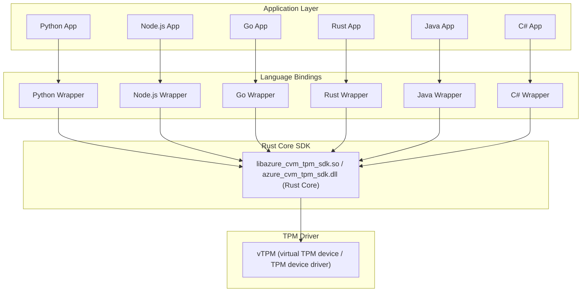

# Azure CVM Attestation SDK – Design Document

## Overview

The Azure CVM Attestation SDK is a modular, multi-language software development kit designed to enable confidential virtual machine (CVM) attestation workflows. The SDK architecture is layered for portability, maintainability, and security:

- **Application Layer:** User applications in various languages (Python, Node.js, Go, Rust, Java, C#) interact with the SDK through language-specific wrappers.
- **Language Bindings:** Each supported language provides a native wrapper that exposes the SDK's functionality in an idiomatic way, using FFI or native bindings to call into the core SDK.
- **Rust Core SDK:** The core logic is implemented in Rust and compiled as a C-compatible dynamic library (`cdylib`) to produce the same runtime artifacts used by existing consumers (Linux `.so` and Windows `.dll`). The Rust core exposes a stable C ABI so existing language bindings that call the previous C library can continue to work without change.
- **vTPM Device Driver / TPM Hardware:** The Trusted Platform Module (TPM) is accessed via the platform's vTPM device driver (virtual TPM provided by the host/hypervisor) or via a physical TPM driver depending on deployment. The Rust core communicates directly with the vTPM/TPM driver interface; driver access is encapsulated in a small, well-reviewed boundary.

This design isolates platform-specific and security-sensitive operations in the Rust core and the driver-access layer, while application developers continue to use high-level, idiomatic APIs in their language of choice. By implementing the core in Rust we gain strong safety guarantees, easier memory-safety reasoning, and a modern toolchain while preserving compatibility via a C-compatible ABI.

## Architecture Diagram



> **Note:** The following diagram uses [Mermaid](https://docs.github.com/en/get-started/writing-on-github/working-with-advanced-formatting/creating-diagrams) syntax. To view it, ensure your Markdown viewer or platform (such as GitHub) supports Mermaid diagrams.

This diagram illustrates the layered design of the SDK:

- The **Application Layer** contains user applications in various languages.

- **Language bindings** (Python, Node.js, Go, Rust, Java, C#) provide idiomatic APIs for each language, calling into the Rust core via a stable C ABI.

- The **Rust Core SDK** (compiled as a `cdylib` such as `libazure_cvm_tpm_sdk.so` or `azure_cvm_tpm_sdk.dll`) implements the core logic and interacts with the TPM via the platform's TPM driver interface. The Rust core encapsulates driver interactions behind a small, well-reviewed boundary and exposes safe Rust abstractions to the rest of the SDK.

- The **vTPM device driver** is the kernel or hypervisor-provided interface to a virtual TPM presented to the guest (in cloud or virtualized environments). On Linux this may still look like `/dev/tpm*` or `/dev/tpmrm*` device nodes backed by a vTPM implementation; in cloud environments the vTPM device is typically provided by the host or hypervisor. The SDK's driver-access layer must account for platform differences, privilege requirements, concurrency/locking semantics, and the possibility that the TPM is virtualized by the cloud provider.

## Key API

The Azure CVM Attestation SDK exposes a minimal, context-based C-compatible API for attestation operations. These function signatures remain the public ABI used by language bindings and applications; they are now implemented in Rust and exported using a C ABI so existing consumers require no change.

> Implementation note: the Rust core exports functions using `#[no_mangle] pub extern "C"` and a `cdylib` crate type. A small Rust example that implements the context create/free functions follows.

### Rust implementation example (exported C ABI)

```rust

#[repr(C)]

pub struct AzureCvmAttestationContext {

    // Internal Rust fields (opaque to C callers)

    // ...existing code...

}


#[no_mangle]

pub extern "C" fn azure_cvm_attestation_create() -> *mut AzureCvmAttestationContext {

    let ctx = Box::new(AzureCvmAttestationContext {

        // initialize fields

    });

    Box::into_raw(ctx)

}


#[no_mangle]

pub extern "C" fn azure_cvm_attestation_free(ctx: *mut AzureCvmAttestationContext) {

    if ctx.is_null() {

        return;

    }

    // Reclaim the boxed context so Rust drops it safely

    unsafe { Box::from_raw(ctx); }

}

```

> Header generation: Use `cbindgen` (or a maintained hand-written header) to produce `azure_cvm_attestation.h` that matches the exported symbols. This header is shipped with native SDK artifacts so consumers can continue using the same C headers.

### Context Management

#### `AzureCvmAttestationContext* azure_cvm_attestation_create()`


Allocates and initializes a new attestation context. Returns a pointer to the context, or NULL on failure.

**Example (C):**

```c

AzureCvmAttestationContext* ctx = azure_cvm_attestation_create();

if (!ctx) {

    // Handle error: failed to create context

}

```

#### `void azure_cvm_attestation_free(AzureCvmAttestationContext* ctx)`


Frees all resources associated with the attestation context.

**Example (C):**

```c

azure_cvm_attestation_free(ctx);

```

### Evidence Access

#### `AzureCvmReportType azure_cvm_attestation_get_report_type(AzureCvmAttestationContext* ctx)`


Returns the report type (SNP, TDX, etc) from the current HCL report in the context.

**Example (C):**

```c

AzureCvmReportType type = azure_cvm_attestation_get_report_type(ctx);

printf("Report type: %d\\n", type);

```

#### `int azure_cvm_attestation_get_hardware_report(AzureCvmAttestationContext* ctx, uint8_t** hw_buf, size_t* hw_len)`


Retrieves the hardware report section from the current HCL report. Allocates a buffer for the report (caller must free). The Rust core will allocate returned buffers in a manner compatible with `free()` on the target platform (for example using the system allocator via `libc::malloc`) or expose explicit free functions when appropriate; this preserves the existing ABI expectations for consumers.

**Example (C):**

```c

uint8_t* hw_buf = NULL;

size_t hw_len = 0;

int rc = azure_cvm_attestation_get_hardware_report(ctx, &hw_buf, &hw_len);

if (rc == 0) {

    // Use hw_buf, hw_len

    free(hw_buf); // valid when the SDK allocates with a compatible allocator

} else {

    // Handle error

}

```

#### `int azure_cvm_attestation_get_runtime_data(AzureCvmAttestationContext* ctx, uint8_t** rt_buf, size_t* rt_len)`


Retrieves the runtime data section from the current HCL report. Allocates a buffer for the data (caller must free). Implementation follows the same allocation compatibility rules as above.

#### `int azure_cvm_attestation_get_hardware_evidence(AzureCvmAttestationContext* ctx, uint8_t** hw_buf, size_t* hw_len, uint8_t** rt_buf, size_t* rt_len)`


Retrieves both the hardware report and runtime data as evidence. Allocates buffers for both (caller must free). Implementation follows the same allocation compatibility rules as above.

### Report Refresh

#### `int azure_cvm_attestation_refresh(AzureCvmAttestationContext* ctx)`


Forces a refresh of the HCL report in the context.

**Example (C):**

```c

int rc = azure_cvm_attestation_refresh(ctx);

if (rc == 0) {

    // Refresh succeeded

} else {

    // Handle error

}

```

### Types

#### `AzureCvmReportType`


Enum for supported report types: `CVM_REPORT_TYPE_INVALID`, `CVM_REPORT_TYPE_RESERVED`, `CVM_REPORT_TYPE_SNP`, `CVM_REPORT_TYPE_TVM`, `CVM_REPORT_TYPE_TDX`.

### Memory Management

- Output buffers returned by the SDK (e.g., hardware report, runtime data) must be freed by the caller. To preserve compatibility with existing consumers that call `free()`, the Rust core will either allocate returned buffers using an allocator compatible with the platform `free()` (for example `libc::malloc`/`libc::free`) or provide dedicated deallocation functions in the SDK where appropriate. The shipped C header documents which approach is used for each function.

- The attestation context must be freed using `azure_cvm_attestation_free()` when no longer needed.

### Build and Tooling (Rust core)

- Use Cargo with a crate configured as `crate-type = ["cdylib"]` in `Cargo.toml` to produce `libazure_cvm_tpm_sdk.so` (Linux) and `azure_cvm_tpm_sdk.dll` (Windows) binaries.

- Use `cbindgen` to generate a consumer C header (`azure_cvm_attestation.h`) that maps to the exported symbols produced by the Rust `cdylib`.

- Implement and maintain small, platform-specific driver access modules in Rust targeted at vTPM device drivers (or physical TPM drivers when present). Typical work-items include:
  - Provide safe Rust wrappers around the vTPM device interface (device nodes and ioctls on Linux, hypervisor-specific interfaces where applicable).
  - Handle cloud-specific vTPM semantics (device presence, lifecycle, and access permissions) and provide feature detection/fallbacks.
  - Minimize and isolate unsafe code; write thorough unit tests for the safe surface and integration tests that exercise driver interaction on platforms that provide vTPM.

  Document required privileges, device-locking semantics, concurrency expectations, and test strategies for vTPM-enabled environments.

- For cross-compilation and CI builds, use established cross toolchains (Rust's cross-compilation support, `cross`, or platform-specific toolchains) and produce release artifacts for supported target triples. Ensure that CI jobs produce both `.so` and `.dll` artifacts and publish the corresponding header files.

- Document the ABI and the memory ownership model clearly in the repository and in the shipped header so language bindings know whether they should call `free()` or an SDK-provided deallocator.

### vTPM Integration Checklist

- Verify vTPM presence: detect device nodes or hypervisor-provided vTPM interfaces at runtime (feature detection). Provide a clear error when no vTPM/TPM is present.
- Permissions and privileges: document required process privileges to open the vTPM device or call driver interfaces; prefer permission-limited service accounts and document any setuid/setcap requirements.
- Device locking and concurrency: ensure the driver-access layer implements appropriate locking to serialize TPM commands when required by the platform.
- Lifecycle and resilience: handle device hot-plug, removal, or virtualization lifecycle events gracefully and document expected behavior.
- Fallbacks and feature-detection: support both vTPM and physical TPM when available; provide clear runtime fallbacks or configuration options.
- Integration testing: maintain integration test VMs/images with vTPM enabled, and run driver-access integration tests in CI where possible (or gated nightly runs when hardware provisioning is required).
- Logging and observability: add diagnostics and clear errors for driver failures to simplify debugging in cloud environments.

## Example Usage

```c

AzureCvmAttestationContext* ctx = azure_cvm_attestation_create();

if (!ctx) {

    // Handle error: failed to create context

}

uint8_t* hw_buf = NULL;

size_t hw_len = 0;

if (azure_cvm_attestation_get_hardware_report(ctx, &hw_buf, &hw_len) == 0) {

    // Use hw_buf, hw_len

    free(hw_buf);

} else {

    // Handle error

}

azure_cvm_attestation_free(ctx);

```